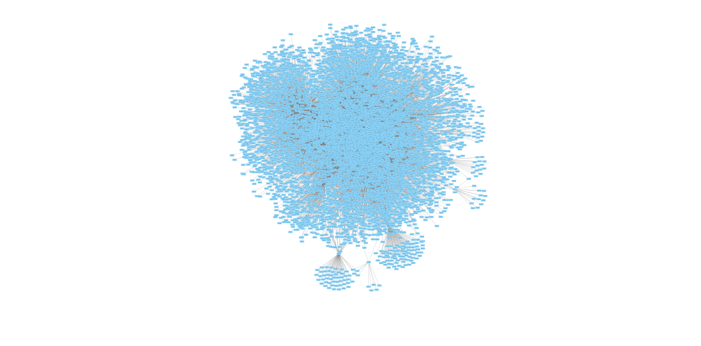

```{r setup, include=FALSE,warning=FALSE}
knitr::opts_chunk$set(echo = FALSE)
```
# Astract

In this project we analyzed the Novikoff hepatoma desease,with the aim of carrying on a network medicine analysis. We started with the data collection,exploring the related information sources (DisGeNet datasets), collecting the the list of human genes of interest and finally scraping protein-protein interaction data. Proceeding with the data analysis we created the graph, we calculated the main network measures for the disease interactome and we applied the MCL algorithm to find out putative disease modules with hypergeometric test and DIAMOnD tool.


## Disease Description: Hepatoma

Novikoff hepatoma mitochondria were studied with regard to their functional and structural organization. The activities of cytochrome oxidase and malate dehydrogenase in mitochondria purified on sucrose gradients were similar in organelles derived from normal liver and hepatoma tissue. However, the activities of reduced nicotinamide adenine dinucleotide oxidase and succinate oxidase in hepatoma mitochondria were reduced to only 10 and 35%, respectively, of the activities in liver mitochondria. Also, monoamine oxidase and rotenone-insensitive reduced nicotinamide adenine dinucleotide-cytochrome c reductase (enzymes localized in the outer mitochondrial membrane) have significantly reduced activities in hepatoma mitochondria. The structural changes in hepatoma mitochondria might be correlated with differences in the banding patterns of liver and hepatoma mitochondria in sucrose gradients. While liver mitochondria banded sharply at a density of 1.187 g/ml, as evidenced by marker enzyme activity and protein assay, hepatoma mitochondria were heterogeneous, banding over a density range of 1.144 to 1.161 g/ml. 


## Seed genes 
To collect the set of seed genes we started by filtering the “Curated gene-disease associations” da-taset from DisGeNet in order to find all the genes associated with hepatoma, making sure they were all human genes.
Subsequently, we used the REST API of HGNC to fetch the status (approved or not) of each seed gene. All the 110 genes collected from DisGeNet resulted approved on HGNC, so we parsed the Uniprot dataset and collected the information requested in 1.1.b. We found that only 80 of the 110 seed genes resulted officially reviewed on Uniprot.
All the data collected has been stored in a .tsv file.


  
### Table visualization  
  
```{r,warning=FALSE}

approved_genes= read.table(file = 'data/approved_genes.tsv', sep = '\t', header = TRUE)
sub_approved_genes = approved_genes[,c("geneId","geneSymbol","uniprotAC","proteinName","notes")]
sub_approved_genes
#library(kableExtra)

#sub_approved_genes %>%
#  kbl() %>%
#  kable_material(c("striped", "hover"))
```


## Summary on interaction data
To collect the interaction data, we started by downloading the full Biogrid dataset and, after that, we wrote a python script to parse the data and extract the interactions. The parsing process was made up of the following steps:
1.	Filtering all the interactions which involved only human genes (ID 9606).
2.	Filtering the interactions which involved at least one seed gene.
3.	Extracting the list of non-seed genes which interacted with seed genes.
4.	Collecting all the interactions between the non-seed genes previously extracted.
5.	Saving all the interactions (after removing duplicates, if present) in a tsv table.
Here are some summary statistics regarding the data collected at this point:
•	No. of Disgenet seed genes:  110
•	No. of seed genes found in Biogrid:  80
•	Total no. of interacting genes:  6319
•	Total no. of interactions:  243222

## Interactomes data
The final step into the interactions collection process was to arrange the interactions into two different tables, the “seed genes interactome” and the “disease interactome”.
The first one contains the interactions just between seed genes, while the second one contains all the interactions which include at least one seed gene.
Here are some summary statistics about the interactomes:
•	No. of interactions in the seed genes interactome: 139
•	No. of interactions in the disease interactome: 13217

### Seed_genes Interactome (first 8)
```{r}
library(kableExtra)

seed_genes_interactome = read.table(file = 'data/seed_genes_interactome.tsv', sep = '\t', header = TRUE)
seed_genes_interactome[1:8,]
#seed_genes_interactome[1:8,] %>%
#  kbl() %>%
#  kable_material(c("striped", "hover"))
```

### Genes Interactome (first 8)

```{r}
library(kableExtra)

interactions = read.table(file = 'data/interactions.tsv', sep = '\t', header = TRUE)
interactions[1:8,]

#interactions[1:8,] %>%
#  kbl() %>%
#  kable_material(c("striped", "hover"))
```


## Enrichment analysis
To carry out the enrichment analysis we took advantage of the REST API offered by Enrichr.
Without going too much into the details of the code, what we did was: extracting the set of all the gene symbols present in the disease interactome and then fetching Enrichr to get the charts related to the gene set libraries specified in the homework. After that, we parsed the charts and kept just the first 10 result for each one and we arranged the data into tsv tables.


### Tables 

#### Biological Process
```{r}
library(kableExtra)

GO_Biological_Process_2018= read.table(file = 'data/GO_Biological_Process_2018.tsv', sep = '\t', header = TRUE)

GO_Biological_Process_2018

#GO_Biological_Process_2018 %>%
#  kbl() %>%
#  kable_material(c("striped", "hover"))
```

#### Cellular Component

```{r}
library(kableExtra)

GO_Cellular_Component_2018= read.table(file = 'data/GO_Cellular_Component_2018.tsv', sep = '\t', header = TRUE)
GO_Biological_Process_2018

#GO_Biological_Process_2018 %>%
#  kbl() %>%
#  kable_material(c("striped", "hover"))
```

#### Molecular Function

```{r}
library(kableExtra)

GO_Molecular_Function_2018= read.table(file = 'data/GO_Molecular_Function_2018.tsv', sep = '\t', header = TRUE)
GO_Molecular_Function_2018
#GO_Molecular_Function_2018 %>%
#  kbl() %>%
#  kable_material(c("striped", "hover"))
```

#### KEGG 

```{r}
library(kableExtra)

KEGG_2019_Human= read.table(file = 'data/KEGG_2019_Human.tsv', sep = '\t', header = TRUE)
KEGG_2019_Human
#KEGG_2019_Human %>%
#  kbl() %>%
#  kable_material(c("striped", "hover"))


```


### Global measures of the disease interactome LCC

```{r}
library(kableExtra)
graph_final_values= read.csv(file = 'data/graph_final_values.tsv', sep = '\t', header = TRUE)
graph_final_values
#graph_final_values %>%
#  kbl() %>%
#  kable_material(c("striped", "hover"))
```


#### Visualize LCC




### First 20 highest ranking genes for betweenness 


```{r,echo=FALSE}
library(kableExtra)
sorted_local= read.csv(file = 'data/sorted_local.tsv', sep = '\t', header = TRUE)
sorted_local
#sorted_local[1:30,] %>%
#  kbl() %>%
#  kable_material(c("striped", "hover"))
```


